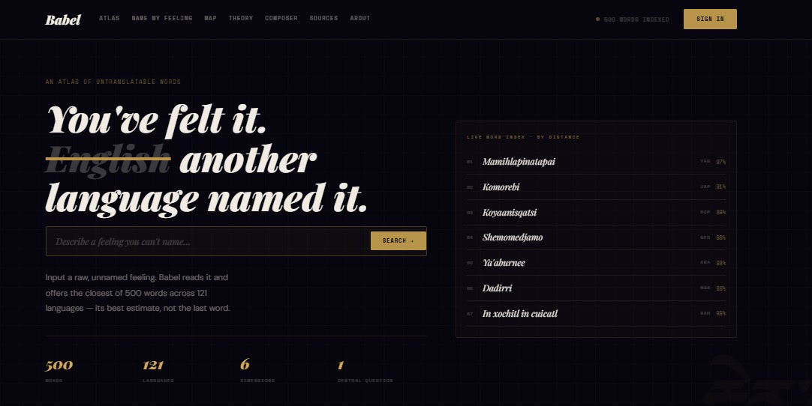
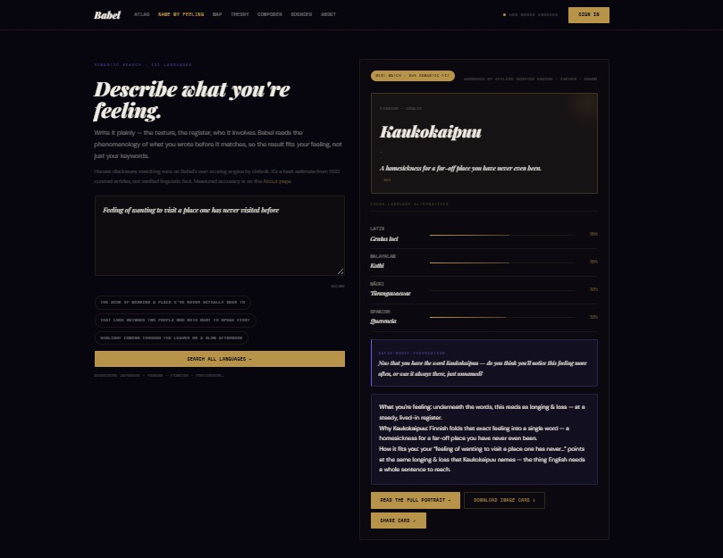
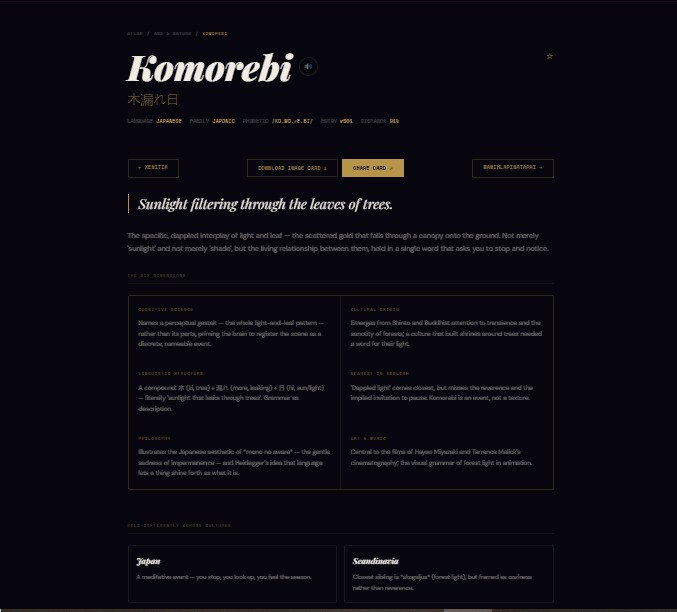
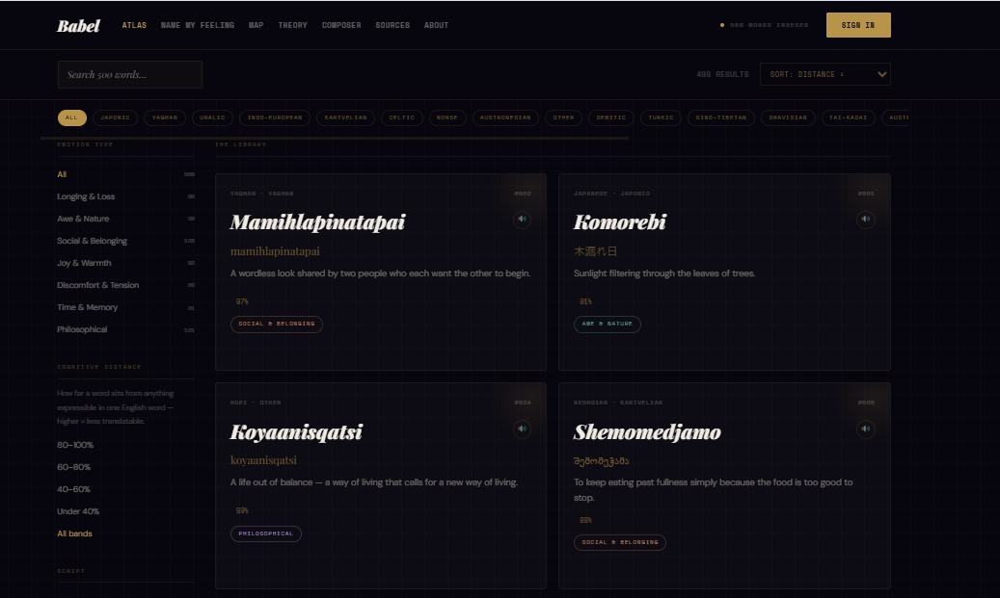

# Project Babel

> *"The limits of my language mean the limits of my world."* — Ludwig Wittgenstein

** Live:** **[project-babel-five.vercel.app](https://project-babel-five.vercel.app)** — full-stack on Vercel + Neon Postgres.

**Babel is an interactive atlas of untranslatable words** — feelings and concepts that exist in one language but have no direct equivalent in English. Describe a feeling in plain language and Babel finds the word for it, drawn from **500 words across 121 languages**, each rendered as a six-dimension portrait.

It is one project in two parts:

- **Frontend** (`site/`) — a zero-build, vanilla-JavaScript single-page app. Open `index.html` and it runs; `data.js` is the bundled source of word data.
- **Backend** (`server/`) — Node.js + Express + Prisma. Serves the JSON API **and** the static site, and is the live source of truth for accounts, saved data, submissions, analytics, and the word database. Uses **PostgreSQL (Neon)** in production (and for local dev); SQLite is still supported for a zero-setup local run.

The frontend calls the real backend first and falls back to `localStorage` and an in-browser engine when opened standalone, so the site works either way.

---

## Screenshots

**[▶ Try the live demo →](https://project-babel-five.vercel.app)**

A quick tour of the interface:

- **Home** — describe a feeling and let Babel name it
- **Name My Feeling** — the closest untranslatable word, with a three-line explanation and cross-language alternatives
- **Word portrait** — each word across six dimensions, with a downloadable / shareable image card
- **Language map** — the whole atlas as a force-directed network, coloured by emotional cluster

| Home | Name My Feeling |
|------|-----------------|
|  |  |
| **Word portrait** | **Atlas** |
|  |  |

---

## Features

### The eight pages
| Page | What it does |
|---|---|
| **Home** `#/` | Manifesto hero, a live "describe a feeling" search box, word-of-the-day, and a clickable word ticker — **click any ticker word to open its shareable image card**. |
| **Atlas** `#/atlas` | All words, browsable and filterable by emotion category, language family, cognitive-distance band, and script; sortable; instant trie-based search. |
| **Word Portrait** `#/word/:slug` | A full six-dimension portrait per word (cognitive science, cultural origin, linguistic structure, nearest English, philosophy, art), cross-cultural notes, closest words in other languages, a recommendation strip, "Ask Babel", pronunciation audio, and image-card **Download / Share**. |
| **Name My Feeling** `#/name-my-feeling` | The centrepiece. Describe a feeling; the engine interprets the emotion and returns the closest word with a **three-line explanation** (what you're feeling / why this word / how it fits) plus cross-language alternatives — **click any alternative to open its image card**. |
| **Language Map** `#/map` | The whole atlas as a force-directed SVG network (also a language-family tree), coloured by emotional cluster. |
| **Theory** `#/theory` | Long-form essay on linguistic relativity with an interactive Boroditsky colour experiment. |
| **Composer** `#/compose` | Write anything; the same semantic engine annotates the untranslatable moments hidden in your prose. |
| **About** `#/about` | The builder's note, honest methodology, tech stack, and a **Submit a word** form. |

Plus **Sources** `#/sources` (honest provenance + measured accuracy), **Account** `#/account` (saved words, saved image cards, and Name-My-Feeling history), and **Admin** `#/admin`.

### Shareable image cards
Every word portrait, Name My Feeling result, and saved card can be **downloaded** as a 1080×1080 PNG or **shared** directly. Sharing uses the native Web Share API (the actual image → any app) on supported devices, and otherwise a share menu of popular platforms: **WhatsApp, X/Twitter, Facebook, Threads, Telegram, LinkedIn, Pinterest, Tumblr, Reddit, Email**, plus image-first apps **Instagram, Snapchat, TikTok, Discord** (hands you the image and opens the app), and copy-image / download fallbacks. The canonical share URL is always `https://` for security.

### The matching engine (Name My Feeling & Composer)
The offline engine ranks words by **TF-IDF cosine similarity** between your input and each word's definition (with light stemming so "visit" matches "visited"), combined with emotion-category resonance. This prioritises the word whose *meaning* actually matches over one that merely shares a common noun. Measured accuracy: **90 % category-match** across 50 independent test inputs (`server/scripts/benchmark.js`). If `ANTHROPIC_API_KEY` is set on the server, it upgrades to Claude with the same JSON contract; the UI honestly discloses which engine answered.

### Accounts, submissions & admin
- **Accounts** — JWT + bcrypt auth (name + email + password), editable, deletable (cascades). Saved words, saved image cards, and search history persist server-side.
- **Community submissions** — screened automatically for duplicates, placeholders, **accuracy/plausibility** (gibberish words and incoherent explanations are rejected; unknown languages flagged), and vagueness, then queued for human review.
- **Admin** (`#/admin`, gated by `ADMIN_KEY`) — usage metrics with charts (users, saved words, **shared cards**, searches, top categories/words), and a moderation queue. **Accepting a submission adds it to the database as a real word**, and there's a word-delete endpoint — so the **word count and browse surfaces update automatically** with the database.

### Live database sync
The bundled `data.js` seeds the atlas so the site works standalone, but on boot the frontend reconciles it with the live database (`GET /api/words/all`): words added via the admin queue are merged in and become fully browsable (atlas, search, portrait, recommendations, map, count), and deleted words disappear — the displayed word count always reflects the database.

### Everywhere
Fully responsive (verified at 375 px mobile and desktop), keyboard-navigable, `prefers-reduced-motion` aware, with pronunciation audio via the Web Speech API.

---

## Run it on your machine

**Prerequisites:** [Node.js](https://nodejs.org/) 18+ (includes `npm`). No database or other services to install — it uses SQLite.

### Full stack (recommended — API + site together)
```bash
cd "Project Babel/server"
npm install
npm run setup     # generates the Prisma client, creates the SQLite DB, seeds 500 words
npm start         # serves the API and the site at http://localhost:4600
```
Then open **http://localhost:4600** in your browser.

- `npm run setup` is idempotent — re-running re-seeds the words from `../site/data.js`.
- The **admin dashboard** is at `http://localhost:4600/#/admin`; the key is `ADMIN_KEY` in `server/.env` (default `babel-admin-2026`).
- Optional: create `server/.env` to override defaults — `PORT`, `JWT_SECRET`, `ADMIN_KEY`, and `ANTHROPIC_API_KEY` (to enable the Claude engine).

### Static only (no backend)
The frontend runs standalone with a `localStorage` fallback — just open `site/index.html`, or serve the folder:
```bash
cd "Project Babel"
npx serve site      # then open the printed http://localhost:xxxx URL
```
Accounts and saved data are then local to the browser, and admin/live-database features are unavailable.

### Verify accuracy (optional)
```bash
cd "Project Babel/server"
node scripts/clear-feeling-cache.js   # clear cached feeling results
node scripts/benchmark.js             # prints category-match rate + latency, writes results/metrics.json
```

---

## Tech stack
- **Frontend:** vanilla JS SPA (hash router, no build step), HTML Canvas (image cards), SVG (force-directed map + charts), Web Speech API (pronunciation), Web Share API.
- **Backend:** Node.js + Express, Prisma ORM, SQLite (PostgreSQL-ready), JWT + bcrypt.
- **AI:** offline TF-IDF cosine matcher; optional Claude (`claude-opus-4-8`) via `ANTHROPIC_API_KEY`.

## Project structure
```
Project Babel/
├─ site/                     # frontend (zero-build SPA)
│  ├─ index.html             #   entry point (script/style cache-buster ?v=N)
│  ├─ data.js                #   bundled word data (single source of truth)
│  ├─ app.js                 #   app: router, pages, engine, share, hydration
│  └─ styles.css
├─ server/                   # backend (Express + Prisma + SQLite)
│  ├─ src/index.js           #   API routes + static hosting + screening
│  ├─ src/ai.js              #   offline matching engine (kept in sync with app.js)
│  ├─ prisma/schema.prisma   #   data model
│  ├─ scripts/               #   benchmark.js, clear-feeling-cache.js
│  ├─ results/metrics.json   #   measured accuracy (read by the site)
│  └─ README.md              #   backend/API reference
└─ README.md                 # this file
```

> **Note on the matching engine:** the offline engine exists in two places kept in sync by hand — `server/src/ai.js` (used by the API) and the fallback in `site/app.js` (used when standalone). Change them together, then clear the feeling cache and re-run the benchmark.

## Deployment (Vercel + Neon Postgres)

The live site runs entirely on Vercel: the static frontend (`site/`) is served from the CDN, and the Express app is wrapped as a **single serverless function** (`api/index.js` → `server/src/index.js`) that talks to a **Neon Postgres** database. `vercel.json` serves `site/` and rewrites `/api/(.*)` to the function.

**Architecture note:** `server/src/index.js` exports the Express `app` and only calls `app.listen()` for local dev (`require.main === module`), so the same code runs both as a long-lived server locally and as a serverless function on Vercel.

**One-time setup**
1. Create a Neon Postgres database (Vercel dashboard → **Storage → Create Database → Neon**). The integration injects `DATABASE_URL` / `DATABASE_URL_UNPOOLED` into the project.
2. Add env vars in Vercel → Settings → Environment Variables: `JWT_SECRET`, `ADMIN_KEY` (and optionally `ANTHROPIC_API_KEY`).
3. Create the tables and seed the words against Neon (with the connection strings in `server/.env`):
   ```bash
   cd server
   npx prisma db push     # create tables (uses the direct/unpooled URL)
   node prisma/seed.js     # load the 500 words
   ```

**Deploying**
- **Git-based (recommended):** push to the connected GitHub repo — Vercel builds and deploys automatically on every push to `main`.
- **CLI:** `cd "Project Babel" && npx vercel deploy --prod --yes`

`schema.prisma` uses `provider = "postgresql"` with `url` (pooled/pgbouncer) for the app and `directUrl` (unpooled) for migrations, plus `binaryTargets = ["native", "rhel-openssl-3.0.x"]` so the Prisma query engine works on Vercel's Linux runtime. For scale, front a Redis cache over the `AiCache` table for shared caching across instances.

---

## License

© 2026 Surabhi Datta. **All rights reserved.** This repository is public for viewing and portfolio evaluation only — no permission is granted to use, copy, modify, or redistribute it without prior written consent. See [LICENSE](LICENSE).

---

*Built by Surabhi Datta. Definitions are curatorial editorial synthesis, not a peer-reviewed lexicon — provenance and measured accuracy are disclosed on the in-app Sources page.*
